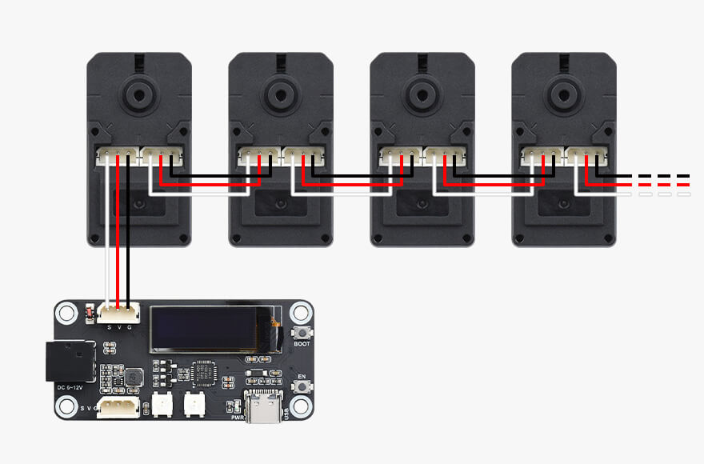

# ST3215 Servo MicroPython Module

The **MicroPython ST3215** module provides a high-level API to control ST3215 servo motors with ease.

---

## Wiring Diagram



---

## Installation

Install the module using `mip`:

```python
import mip
mip.install("github:aadankan/micropython-st3215")
```
---

## Documentation

📖 Complete documentation, including usage examples and API reference, is available at:

[https://aadankan.github.io/micropython-st3215/](https://aadankan.github.io/micropython-st3215/)

---

## Features

- Simple and Pythonic API
- Supports multiple ST3215 servos
- MicroPython compatible
- Includes wiring and usage examples

---

## License

MIT License

